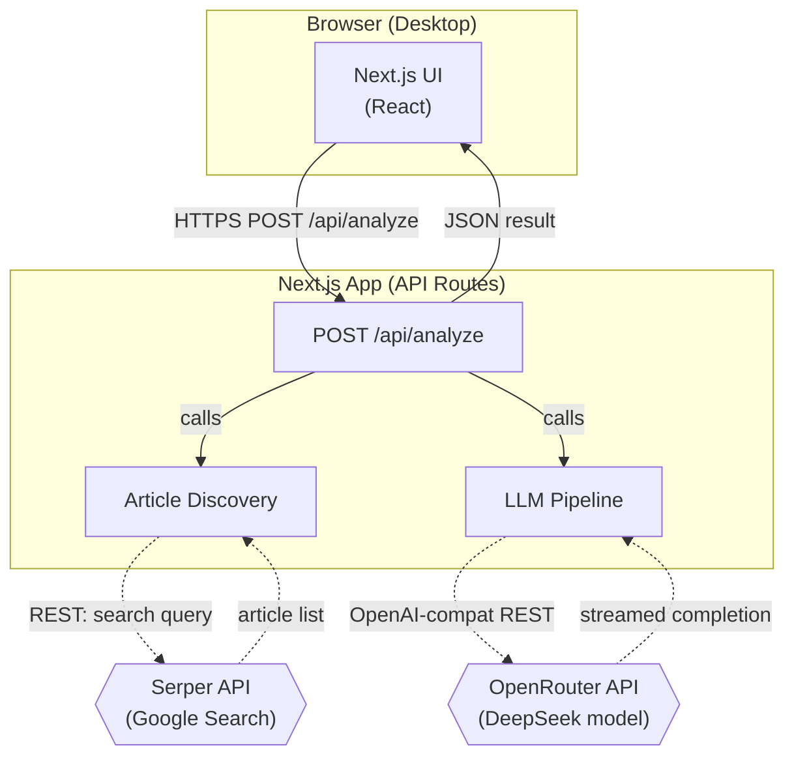
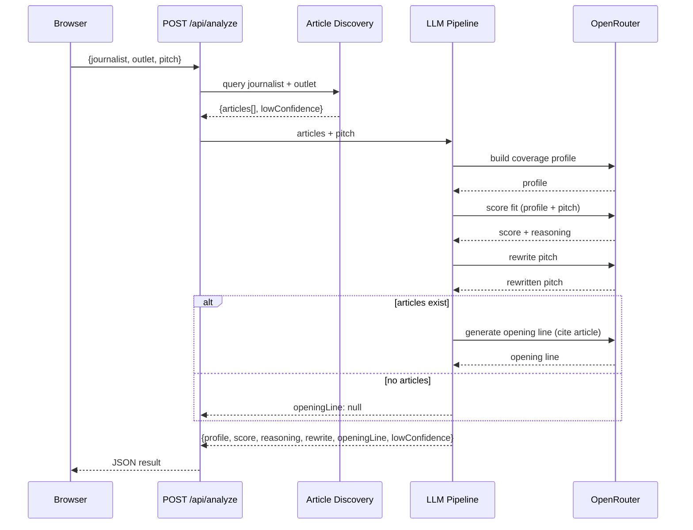

# Architecture

> **Project:** Byline

## Status

Canon — update this file whenever a component is added, replaced, or its role changes.

## System Topology

## Tech Stack

| Layer | Choice | Why |
|:---|:---|:---|
| Frontend + API | Next.js 14 (App Router) | Single framework — UI and API routes colocated. Fastest path to a working demo with no separate backend process to coordinate. |
| LLM | OpenRouter API, model `deepseek/deepseek-v4-flash-0731` | OpenAI-compatible REST. Model swappable via `OPENROUTER_MODEL` env var — no code change required to try another model. |
| Web search | Serper API | Simple REST, returns structured results (title, URL, date, snippet). Avoids scraping complexity for demo phase. |
| Styling | Tailwind CSS | Desktop-first layout, fast to prototype, no design system overhead. |
| Runtime | Node.js (via Next.js) | LLM + search are pure I/O-bound — async/await handles the pipeline without a separate Python or Go service. |

## Components

### Next.js App (`frontend/`)

- **Responsibility:** Serves the UI and executes the full analysis pipeline via a single API route (`POST /api/analyze`). Orchestrates article discovery and the LLM pipeline in sequence.
- **Depends on:** Serper API (article discovery), OpenRouter API (LLM completions).

### Article Discovery (`frontend/src/lib/search.ts`)

- **Responsibility:** Takes journalist name + outlet, queries Serper API, returns a list of articles (title, URL, date, snippet). Checks result count against the configurable low-confidence threshold (default: 5). Returns a `lowConfidence: boolean` flag alongside the article list.
- **Depends on:** Serper API.

### LLM Pipeline (`frontend/src/lib/llm.ts`)

- **Responsibility:** Takes journalist articles + user pitch, runs a sequential chain of LLM calls: (1) coverage profile, (2) fit score + reasoning, (3) pitch rewrite, (4) opening line. Opening line generation is skipped and replaced with a flag if no articles were found.
- **Depends on:** OpenRouter API. Reads `OPENROUTER_MODEL` env var to select the model at runtime.

## Data Flow

The analysis pipeline order matters — coverage profile must complete before scoring and rewrite, and article list must be verified before opening line generation:

## Data Stores

None. Byline is fully stateless for v1 — no database, no cache, no session storage. Each request is self-contained.

## Boundaries

- **Auth boundary:** None in v1. The API route is publicly accessible. API keys for Serper and OpenRouter are server-side env vars only — never exposed to the browser.
- **Persistence boundary:** N/A — no data store exists.

## Cross-Cutting Concerns

| Concern | Approach |
|:---|:---|
| Auth & authorization | None in v1 — demo context, no user accounts. |
| Logging | `console.error` on API route catch blocks. Structured logging deferred to post-demo. |
| Error handling | API route catches all errors and returns a structured JSON error response `{error: string}`. UI displays the error inline. Never surfaces raw stack traces to the browser. |
| Caching | No caching in v1. Each submit triggers a fresh search + LLM chain. |
| Rate limiting | None in v1. Serper and OpenRouter enforce their own limits; 429s bubble up as user-facing errors. |
| Configuration (major/minor tunables) | `OPENROUTER_MODEL`, `SERPER_API_KEY`, `OPENROUTER_API_KEY`, `LOW_CONFIDENCE_THRESHOLD` (default: 5) — all read from env vars. No redeploy required to change model or threshold. |

- Hallucination guard: the opening line LLM prompt is given only the article titles/URLs from discovery results, not free recall. If the article list is empty, the opening line step is skipped entirely rather than asking the model to generate from memory.
- All LLM calls are sequential within a single request — parallel LLM calls would complicate error handling and ordering for no latency gain at demo scale.
